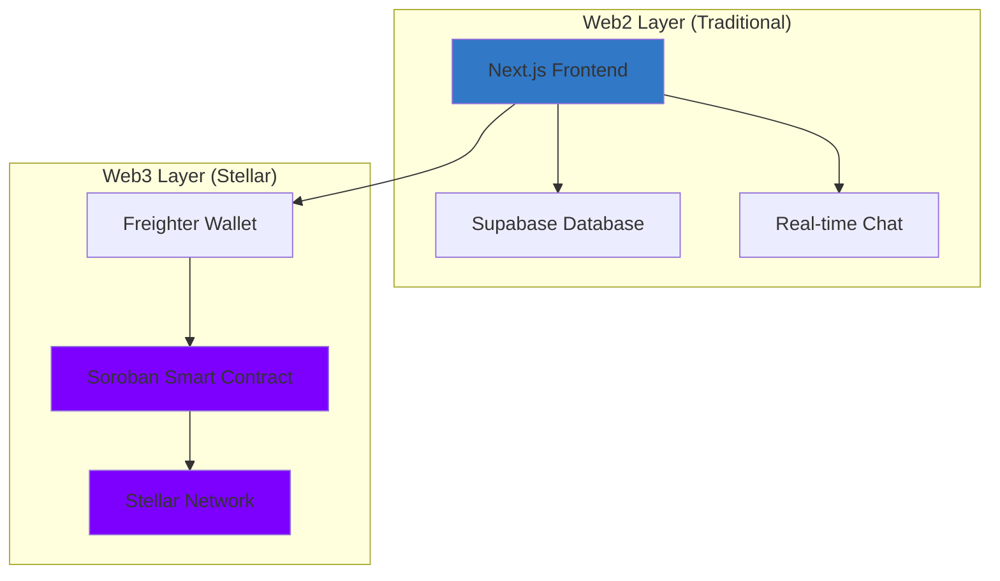

# PayEasy 

**Blockchain-powered rent sharing made simple.**

PayEasy is an open-source platform built on the Stellar blockchain that makes finding roommates and managing shared rent payments seamless, secure, and transparent.

[](https://stellar.org)
[](https://www.typescriptlang.org/)
[](https://codecov.io/gh/Ogstevyn/payeasy)
[](./LICENSE)

---

## The Problem

Coordinating rent among roommates is messy:
- One person always plays "banker"
- Late payments cause friction
- No transparency in who paid what
- Trust issues with strangers from online listings

##  The Solution

PayEasy combines a **social marketplace** (find roommates & apartments) with **blockchain escrow** (trustless rent collection):

1. **Browse Listings**: Find apartments or roommates on a beautiful newsfeed
2. **Chat & Negotiate**: Message potential roommates in real-time
3. **Create Agreement**: Generate a Stellar smart contract for rent splitting
4. **Pay Securely**: Each roommate pays their share directly to the contract
5. **Auto-Disburse**: Once full rent is collected, funds automatically go to the landlord

---

## Architecture

PayEasy uses a **Web2.5 hybrid approach**:



**Why Hybrid?**
- **Fast & Familiar**: Social features (posts, chat) use traditional databases for speed
- **Secure Payments**: Only the escrow logic touches the blockchain, reducing friction
- **Mass Adoption**: Users don't need crypto knowledge to browse—only to pay

---

## 🚀 Tech Stack

### Frontend
- **Framework**: Next.js 14+ (App Router)
- **Language**: TypeScript (strict mode)
- **Styling**: Tailwind CSS + Custom CSS
- **Database**: Supabase (PostgreSQL + Realtime)
- **Wallet**: Freighter (Stellar browser extension)

### Smart Contracts
- **Language**: Rust
- **Platform**: Soroban (Stellar smart contracts)
- **Network**: Stellar Testnet → Mainnet

---

## Project Structure

```
payeasy/
├── apps/
│   └── web/              # Next.js frontend application
├── contracts/
│   └── rent-escrow/      # Soroban smart contract (Rust)
├── docs/                 # Detailed documentation
│   ├── ARCHITECTURE.md
│   └── STELLAR_SETUP.md
├── .github/              # Issue/PR templates
├── README.md
├── CONTRIBUTING.md
├── CODE_OF_CONDUCT.md
└── LICENSE
```

---

## Quick Start

### Prerequisites
- **Node.js** 18+ and npm
- **Rust** and Cargo (for smart contracts)
- **Soroban CLI** ([installation guide](https://soroban.stellar.org/docs/getting-started/setup))
- **Freighter Wallet** ([Chrome extension](https://www.freighter.app/))

### Installation

1. **Clone the repository**
   ```bash
   git clone https://github.com/Ogstevyn/payeasy.git
   cd payeasy
   ```

2. **Install dependencies**
   ```bash
   npm install
   ```

3. **Set up environment variables**
   ```bash
   cp apps/web/.env.example apps/web/.env.local
   # Edit .env.local with your Supabase credentials
   ```

4. **Run the development server**
   ```bash
   npm run dev
   ```

5. **Build the smart contract** (optional)
   ```bash
   cd contracts/rent-escrow
   soroban contract build
   ```

6. **Deploy the smart contract**
   Ensure `DEPLOYER_SECRET_KEY` is set in your `apps/web/.env.local`.
   ```bash
   npm run deploy:contract
   ```
   To verify it exists:
   ```bash
   npm run verify:contract <INSERT_CONTRACT_ID>
   ```

For detailed setup instructions, see [CONTRIBUTING.md](./CONTRIBUTING.md).

---

## E2E Testing

PayEasy uses [Playwright](https://playwright.dev/) for end-to-end testing.

```bash
# Install Playwright browsers (first time)
npx playwright install

# Run all E2E tests
npm run test:e2e

# Run with interactive UI
npm run test:e2e:ui
```

Tests cover the following user flows:
- **Auth** — login form, registration, validation, navigation
- **Listings** — browse page, filters, view toggle, search
- **Messages** — conversation rendering, sending, error handling

---

## Documentaton

- **[Architecture Overview](./docs/ARCHITECTURE.md)**: Deep dive into system design
- **[Stellar Setup Guide](./docs/STELLAR_SETUP.md)**: Configure Soroban development environment
- **[Contributing Guide](./CONTRIBUTING.md)**: How to contribute to PayEasy
- **[Code of Conduct](./CODE_OF_CONDUCT.md)**: Community guidelines

---

## Contributing

We welcome contributions from developers of all skill levels! Here's how to get started:

1. Check out [good first issues](https://github.com/Ogstevyn/payeasy/labels/good%20first%20issue)
2. Read the [Contributing Guide](./CONTRIBUTING.md)
3. Fork the repo and create a feature branch
4. Submit a pull request

**Areas we need help with:**
- UI/UX design and frontend components
- Soroban smart contract development
- Documentation and tutorials
- Testing and QA
- Internationalization

---

## Roadmap

### Phase 1: MVP (Current)
- [x] Project setup and documentation
- [ ] Basic newsfeed UI
- [ ] Wallet connection (Freighter)
- [ ] Simple rent escrow contract

### Phase 2: Social Features
- [ ] Real-time messaging (Supabase)
- [ ] User profiles
- [ ] Post creation (roommate/apartment listings)
- [ ] Search and filters

### Phase 3: Advanced Escrow
- [ ] Multi-party rent splitting
- [ ] Recurring payments
- [ ] Dispute resolution
- [ ] Payment history dashboard

### Phase 4: Production
- [ ] Mainnet deployment
- [ ] Mobile app (React Native)
- [ ] Stellar Community Fund proposal

---

## Why Stellar?

- **Low Fees**: Transactions cost fractions of a cent
- **Fast**: 3-5 second settlement times
- **Built for Payments**: Designed for real-world financial applications
- **Soroban**: Modern smart contract platform with Rust

PayEasy helps drive **crypto adoption to the masses** by solving a real problem people face every month: paying rent.

---

## License

This project is licensed under the MIT License - see the [LICENSE](./LICENSE) file for details.

---

## Community

- **GitHub Discussions**: [Ask questions & share ideas](https://github.com/Ogstevyn/payeasy/discussions)
- **Issues**: [Report bugs or request features](https://github.com/Ogstevyn/payeasy/issues)

---

## Acknowledgments

Built with love by the open-source community.

Special thanks to:
- [Stellar Development Foundation](https://stellar.org) for the blockchain infrastructure
- All our [contributors](https://github.com/Ogstevyn/payeasy/graphs/contributors)

---

**Ready to make rent payments easy?** Star this repo and join us in building the future of shared housing!
